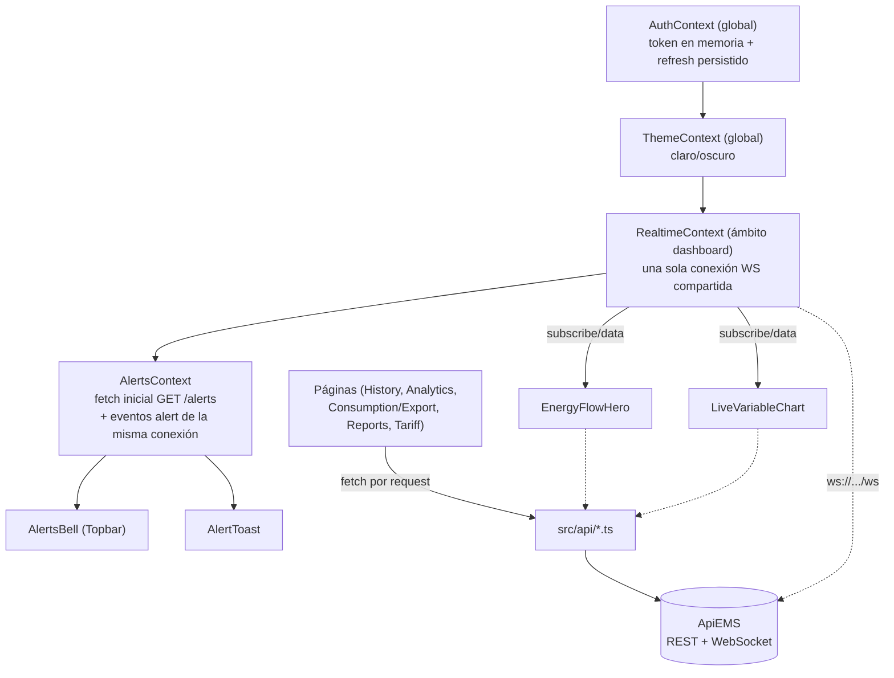

# EMS Residencial — Frontend

Dashboard de monitoreo energético residencial: potencia en tiempo real, históricos, analítica, costos en COP, alertas de consumo anómalo y reportes exportables. Consume la API REST + WebSocket de `ApiEMS` (FastAPI).

## Stack

- React + TypeScript, compilado con [Rsbuild](https://rsbuild.rs)
- TailwindCSS v4
- React Context API (sin Redux/Zustand)
- axios · react-router-dom · Recharts · [lightweight-charts](https://tradingview.github.io/lightweight-charts/) (gráfica en vivo) · framer-motion · lucide-react
- date-fns / date-fns-tz (zona `America/Bogota`)
- jsPDF (informes ejecutivos)

## Gráficas

Este frontend es, ante todo, un consumidor de series de tiempo — cada página gira alrededor de una o varias gráficas:

| Gráfica | Dónde | Librería | Detalle |
|---|---|---|---|
| Potencia/voltaje/corriente en vivo | Dashboard | `lightweight-charts` | streaming real por WS, pan/zoom nativo, tooltip con crosshair, líneas mín/máx, buffer de 6h con backfill histórico al abrir |
| Diagrama de flujo de energía | Dashboard | SVG + framer-motion | animación de dirección importación/exportación en tiempo real |
| Históricos por rango | Histórico | Recharts (`AreaChartWidget`) | `/history` o `/history/downsample` según el tamaño del rango |
| Importado vs. exportado | Consumo/Exportación, Reportes | Recharts (`ComparisonBarChart`) | barras agrupadas por periodo, en kWh y en COP |
| Perfil horario / semanal | Analítica | Recharts + gráfica nativa en PDF | picos de consumo/exportación resaltados |
| Comparación de periodos | Analítica | tarjetas + deltas | kWh y COP lado a lado con variación porcentual |
| Informe ejecutivo | Analítica → PDF | jsPDF (vectorial, no captura) | gráfica de barras dibujada a mano en el PDF, no una imagen |

Todas comparten paleta semántica fija (ámbar = importación, verde = exportación/favor) y conversión de zona horaria a `America/Bogota` — nunca se muestra un timestamp crudo en UTC.

## Requisitos

- Node 20+
- Backend `ApiEMS` corriendo y accesible (REST + WebSocket)

## Configuración

Copia `.env.example` a `.env` y define:

```bash
PUBLIC_API_BASE_URL=http://localhost:8000
PUBLIC_WS_URL=ws://localhost:8000/ws
```

Si el backend queda detrás de un túnel ngrok, usa `https://`/`wss://` — el cliente HTTP ya envía el header `ngrok-skip-browser-warning` automáticamente cuando detecta un dominio `*.ngrok-free.app` (evita el interstitial de advertencia del plan gratis).

## Comandos

```bash
npm install       # instalar dependencias
npm run dev        # servidor de desarrollo (http://localhost:3000)
npm run build       # build de producción → dist/
npm run preview      # previsualizar el build de producción
npm run lint         # ESLint
npm run lint:fix      # ESLint con autofix
npm run format         # Prettier
npm run typecheck       # tsc --noEmit
```

## Estructura

```
src/
  api/            # cliente HTTP + un módulo por dominio (auth, dashboard, history,
                   # consumption, export, analytics, kpis, reports, alerts, tariff, costs)
                   # + cliente WebSocket (websocket.ts) y tipos (types.ts)
  context/         # AuthContext y ThemeContext (globales) · RealtimeContext y
                    # AlertsContext (ámbito dashboard, comparten la única conexión WS)
                    # · DashboardFiltersContext (ámbito página)
  hooks/            # useAuth, useTheme, useRealtime, useAlerts, useLocalClock…
  components/
    ui/              # átomos: Card, Badge, Skeleton, DateRangePicker…
    charts/           # wrappers de Recharts + LiveLineChart (lightweight-charts)
    layout/            # Sidebar, Topbar, AppLayout, ProtectedRoute, AlertsBell, AlertToast
    dashboard/          # widgets de negocio: EnergyFlowHero, LiveVariableChart,
                         # CostCard, CostBreakdownSummary, AnalyticsSummary…
  pages/             # Login, Dashboard, History, ConsumptionExport, Analytics,
                      # Reports, Tariff
  types/              # tipos de dominio compartidos (catálogo de variables, etc.)
  utils/               # formateo (COP, kWh, W, fechas), conversión de zona horaria,
                        # generador del PDF ejecutivo
```

## Arquitectura

Jerarquía de contextos y de dónde saca sus datos cada pieza del dashboard:



`RealtimeContext` y `AlertsContext` viven en `AppLayout`, dentro de `ProtectedRoute` — no en `main.tsx` — porque solo tienen sentido tras autenticarse. El backend permite una única variable suscrita por conexión: `EnergyFlowHero` y `LiveVariableChart` negocian esa suscripción compartida (la que la pide explícitamente por clic gana; si pierde la suscripción, el widget queda mostrando el último valor conocido en vez de romperse).

## Despliegue

El workflow `.github/workflows/deploy.yml` construye y publica en GitHub Pages en cada push a `main`. La URL del backend se inyecta en build time desde **Settings → Secrets and variables → Actions → Variables** del repo (`PUBLIC_API_BASE_URL`, `PUBLIC_WS_URL`) — no se versiona en el código.

Como Pages sirve el sitio bajo una subruta, el build de CI define `PUBLIC_BASE_PATH` para que assets y rutas del router queden correctamente prefijados; en desarrollo local no hace falta.
