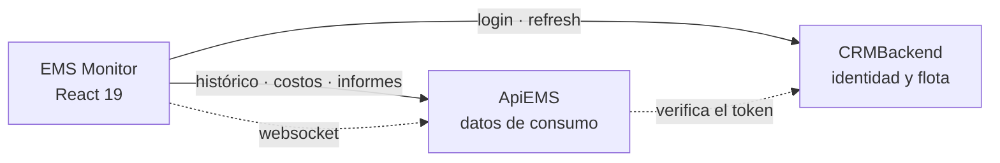

<div align="center">

# 📊 EMS Monitor

### El panel que ve el cliente: su consumo en vivo, su histórico y su factura estimada

[](https://react.dev/)
[](https://www.typescriptlang.org/)
[](https://rsbuild.rs/)
[](tests/)

[Qué hace](#qué-hace) •
[Instalación](#instalación) •
[Pantallas](#pantallas) •
[Estructura](#estructura-del-proyecto) •
[Tests](#tests)

</div>

---

## Tabla de Contenidos

- [Qué hace](#qué-hace)
- [Arquitectura](#arquitectura)
- [Requisitos](#requisitos)
- [Instalación](#instalación)
- [Variables de entorno](#variables-de-entorno)
- [Pantallas](#pantallas)
- [Estructura del proyecto](#estructura-del-proyecto)
- [Tests](#tests)
- [Troubleshooting](#troubleshooting)

---

## Qué hace

EMS Monitor es la web que abre **el cliente**, no el operador. Muestra lo que
mide su propia instalación: la potencia segundo a segundo, el histórico, cuánta
energía importó y exportó, y qué va a costar.

|                               |                                                                                       |
| ----------------------------- | ------------------------------------------------------------------------------------- |
| ⚡ **Consumo en vivo**        | Gráficas por WebSocket, con una hora de historial detrás para que no arranquen vacías |
| 📈 **Histórico**              | Cualquier intervalo entre 1 minuto y 24 horas, con descarga en CSV                    |
| 💰 **Costo estimado**         | Con la tarifa que el CRM tenga cargada                                                |
| 🏢 **Vista de administrador** | Quien administra la plataforma entra al mismo panel y elige qué empresa mirar         |

Desde la consolidación de contratos, el tablero se arma con **una sola llamada** a
`GET /dashboard/summary` y los informes salen de `/reports/*`. El cliente de
ApiEMS ya no toca los endpoints que el backend deprecó.

---

## Arquitectura


```mermaid
flowchart LR
    UI["EMS Monitor<br/>React 19"]
    CRM["CRMBackend<br/>identidad y flota"]
    API["ApiEMS<br/>datos de consumo"]

    UI -->|"login · refresh"| CRM
    UI -->|"histórico · costos · informes"| API
    UI -.->|"websocket"| API
    API -.->|"verifica el token"| CRM
```

El panel habla con **dos servidores** y por eso hay dos clientes HTTP:
CRMBackend devuelve el objeto directo, ApiEMS lo envuelve en
`{success, message, data}`. Compartir instancia obligaría a que cada llamada
supiera cuál de las dos formas le toca.

---

## Requisitos

|            |                                                      |
| ---------- | ---------------------------------------------------- |
| Node       | 20 o superior                                        |
| CRMBackend | corriendo, con un usuario de rol `cliente` o `admin` |
| ApiEMS     | corriendo                                            |

---

## Instalación

```bash
npm install
cp .env.example .env
nano .env
npm run dev
```

| Comando             | Qué hace                            |
| ------------------- | ----------------------------------- |
| `npm run dev`       | Servidor de desarrollo, con recarga |
| `npm run build`     | Producción, a `dist/`               |
| `npm run preview`   | Sirve el build ya hecho             |
| `npm test`          | Las pruebas                         |
| `npm run typecheck` | TypeScript, sin emitir              |

---

## Variables de entorno

| Variable              | Ejemplo                                                       |
| --------------------- | ------------------------------------------------------------- |
| `PUBLIC_API_BASE_URL` | `http://localhost:8001` — sin `/api/v1`, el cliente lo agrega |
| `PUBLIC_WS_URL`       | `ws://localhost:8001/ws`                                      |
| `PUBLIC_CRM_BASE_URL` | `http://localhost:8000`                                       |

Las tres llevan el prefijo `PUBLIC_` porque Rsbuild solo expone al navegador las
que lo tienen. **Todo lo que esté acá es público**: viaja dentro del paquete que
descarga cualquiera. No pongas secretos.

El 8001 y no el 8000 porque CRMBackend suele ocupar el 8000 en la misma máquina.

---

## Pantallas

| Ruta                  | Quién entra     | Qué muestra                             |
| --------------------- | --------------- | --------------------------------------- |
| `/login`              | todos           | Ingreso                                 |
| `/cambiar-password`   | primer ingreso  | Cambio obligatorio                      |
| `/proyectos`          | administradores | Las empresas en tarjetas, con su estado |
| `/dashboard`          | cliente         | Flujo de energía y gráficas en vivo     |
| `/history`            | cliente         | Histórico con intervalo elegible        |
| `/consumption-export` | cliente         | Importada y exportada                   |
| `/analytics`          | cliente         | Comparativas por período                |
| `/reports`            | cliente         | Informes en PDF                         |

### El administrador

Cae en `/proyectos` y no en el tablero: su cuenta no pertenece a ninguna
empresa. Al elegir una, **el panel funciona igual que para un cliente** — no hay
una segunda versión de cada pantalla. Una banda ámbar arriba avisa de qué
empresa son los números, con la salida al lado.

### Las variables no están escritas

El panel pide `GET /variables` y dibuja lo que venga, agrupado por magnitud.
Una fase que el medidor no reporta no aparece, y una variable nueva cargada en
el CRM llega sola.

---

## Estructura del proyecto

```
src/
├── api/                Los dos clientes HTTP y los tipos
├── context/            Sesión, variables, tiempo real, medidor elegido
├── domain/salud.ts     Qué le falta a un proyecto para estar midiendo
├── components/
│   ├── charts/           Recharts
│   ├── dashboard/        Gráfica en vivo, flujo de energía, costos
│   ├── layout/           Sidebar, topbar, avisos
│   └── proyectos/        Gateways caídos de toda la flota
└── pages/              Una por ruta
```

---

## Tests

```bash
npm test
```

149 pruebas. Lo que más se cuida es **lo que no debe pasar**: que una fase sin
datos no genere una gráfica vacía, que un secreto no llegue al navegador antes
de pedirlo, que el WebSocket no se abra cuando no hay nada que suscribir. Cada
pantalla que llama a ApiEMS tiene una prueba que cuenta exactamente cuántas
llamadas espera, así un consumo duplicado deja rojo el grupo de helpers.

---

## Troubleshooting

| Síntoma                                | Causa probable                                                                                    |
| -------------------------------------- | ------------------------------------------------------------------------------------------------- |
| `WebSocket connection failed`          | ApiEMS corre una versión vieja. El navegador cierra la conexión y el código de cierre nunca llega |
| Las gráficas muestran ceros            | El gateway publica con nombres viejos: los del CRM y los de InfluxDB tienen que coincidir         |
| Falta una fase en el desplegable       | Ese medidor no la reporta. Solo se ofrece lo que tiene datos                                      |
| `401` en todo después de entrar        | Falta cambiar la contraseña del primer ingreso                                                    |
| Un administrador ve el tablero en cero | Ese proyecto no tiene medidores configurados. El aviso lo dice                                    |
